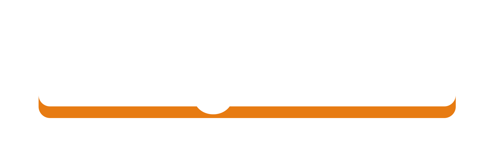
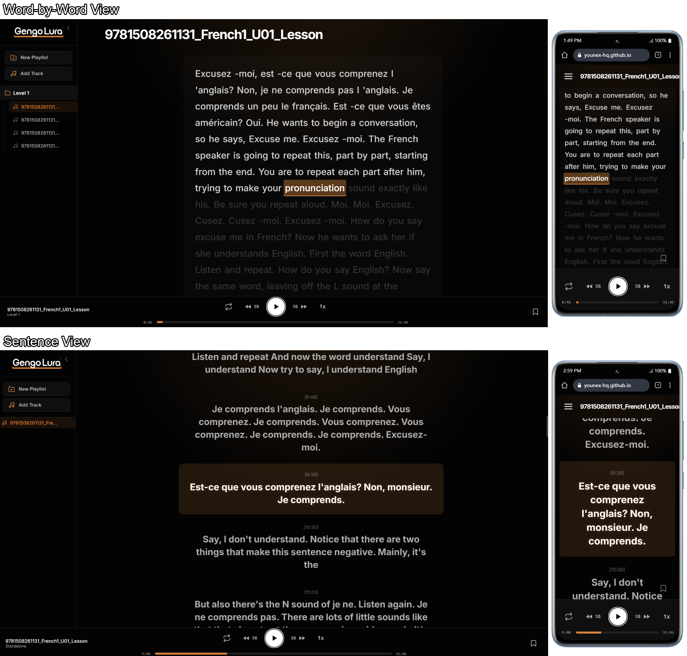

# GengoLura (Audio & Transcript Player)



**Gengo** (Japanese: _Language_) + **Lura** (Swedish: _Listen_) = **GengoLura** (Language Listening).

## Long story short:

It's a local Spotify for audio files with transcripts, upload audio + transcripts (vtt), organize them into playlists (folders), and play them back with synchronized word-level highlighting. You can bookmark specific words or sentences to review later. It's all done locally in your browser, so your files never touch a server.

[](https://younex-hq.github.io/GengoLura/)

> NOTE : the accuracy of the highlighting depends on the accuracy of the .VTT file provided by the user.

> Try it out at : [github page - GengoLura](https://younex-hq.github.io/GengoLura/)

## Corp Description :

GengoLura is an interactive web application designed for high-performance language learning and audio review. Synchronize your audio recordings with WebVTT transcripts for a seamless, immersive study experience.

## Features

- **Advanced Highlighting**:
  - **Word Mode**: Precise, sliding highlights that track every word in real-time.
  - **Sentence Mode**: Paragraph-style view for broader context and sentence-level focus.
- **Smart Library Management**: Organize your files into **Folders** (Playlists) or keep them as **Standalone Tracks**.
- **Flexible Storage**:
  - **Browser Mode**: Store full audio/VTT blobs in IndexedDB for instant access.
  - **Device Mode (Recommended)**: Save only metadata to keep your browser light. Simply "Locate" your local files when you want to play.
- **Bookmark System**: Pin specific timestamps or sentences to your "Bookmarks" folder for quick review later.
- **Interactive Transcript**: Click any word or sentence to jump the audio exactly to that timestamp.
- **Privacy First**: Everything runs locally in your browser. Your files never touch a server.

## Preparation & Transcription

To get the most out of this app, you need high-quality `.vtt` (WebVTT) transcript files.

if you are looking for a good local audio transcription software, you can :
Use [Buzz](https://github.com/chidiwilliams/buzz) to generate word-level transcripts for your audio files, then import them here for a premium playback experience.

---

## Getting Started

### Prerequisites

- [Node.js](https://nodejs.org/)
- [pnpm](https://pnpm.io/) (Recommended)

### Installation

1. Clone the repository:

   ```bash
   git clone <this repository link>
   cd GengoLura
   ```

2. Install dependencies:

   ```bash
   pnpm install
   ```

3. Start development server:

   ```bash
   pnpm run dev
   ```

4. Build for production:

   ```bash
   pnpm run build
   ```

   - preview : `pnpm run preview`

## Tech Stack

- **Core**: Vanilla TypeScript, Vite
- **Storage**: IndexedDB (idb)
- **Styling**: Custom CSS (Spotify-inspired Dark Theme)
- **Parsing**: Custom WebVTT Parser

## Project Structure

- `src/main.ts`: Application controller and UI logic.
- `src/modules/player.ts`: Robust audio playback engine.
- `src/modules/subtitles.ts`: High-precision VTT parser.
- `src/utils/indexedDB.ts`: Persistent storage configuration.
- `public/`: Place your `logo.png` and `favicon.ico` here.

## License

MIT License - feel free to use and adapt this for your own projects (the Logo is not under MIT License)
