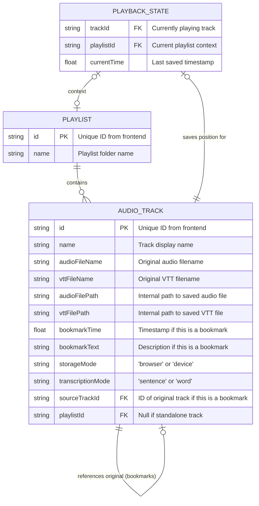

# GengoLura Backend API Specification

This document defines the RESTful API endpoints and payloads required for the GengoLura external database synchronization. The backend should be built using **NestJS**, **TypeORM**, and **PostgreSQL**.

## Database Schema



## Base URL

The base URL is configurable in the frontend settings (e.g., `https://api.gengolura.com/v1`).

## Data Models

### Playlist

```typescript
{
  id: string;        // UUID or unique string
  name: string;      // Playlist name
  tracks: AudioTrack[];
}
```

### AudioTrack

```typescript
{
  id: string;
  name: string;
  audioFileName: string;
  vttFileName?: string;
  audioFilePath?: string; // Backend-only: managed by server
  vttFilePath?: string;   // Backend-only: managed by server
  bookmarkTime?: number;
  bookmarkText?: string;
  storageMode: 'browser' | 'device';
  transcriptionMode: 'sentence' | 'word';
  sourceTrackId?: string;
}
```

---

## Endpoints

### 1. Playlists

#### GET `/playlists`

Retrieve all playlists for the current user.

- **Response**: `Playlist[]`
- **Example Response**:

```json
[
  {
    "id": "1716028400000",
    "name": "Spanish Level 1",
    "tracks": [
      {
        "id": "track-1716028400000-0",
        "name": "Lesson 01",
        "audioFileName": "lesson01.mp3",
        "vttFileName": "lesson01.vtt",
        "storageMode": "browser",
        "transcriptionMode": "word"
      }
    ]
  }
]
```

#### POST `/playlists`

Create or update a playlist.

- **Payload**: `Playlist`
- **Logic**: If a playlist with the same `id` exists, update it. Otherwise, create it.
- **Example Payload**:

```json
{
  "id": "1716028400000",
  "name": "Spanish Level 1",
  "tracks": [
    {
      "id": "track-1716028400000-0",
      "name": "Lesson 01",
      "audioFileName": "lesson01.mp3",
      "vttFileName": "lesson01.vtt",
      "storageMode": "browser",
      "transcriptionMode": "word"
    }
  ]
}
```

- **Response**: `201 Created` or `200 OK` with the saved object.

#### DELETE `/playlists/:id`

Delete a playlist by ID.

- **Parameters**: `id` (string)
- **Response**: `204 No Content`

### 2. Standalone Tracks

#### GET `/tracks/standalone`

Retrieve all standalone tracks (tracks not inside a playlist).

- **Response**: `AudioTrack[]`
- **Example Response**:

```json
[
  {
    "id": "track-1716028500000-0",
    "name": "Daily News Audio",
    "audioFileName": "news_may18.mp3",
    "vttFileName": "news_may18.vtt",
    "storageMode": "device",
    "transcriptionMode": "sentence"
  }
]
```

#### POST `/tracks/standalone`

Create or update a standalone track.

- **Payload**: `AudioTrack`
- **Example Payload**:

```json
{
  "id": "track-1716028500000-0",
  "name": "Daily News Audio",
  "audioFileName": "news_may18.mp3",
  "vttFileName": "news_may18.vtt",
  "storageMode": "device",
  "transcriptionMode": "sentence"
}
```

- **Response**: `201 Created` or `200 OK`.

#### DELETE `/tracks/standalone/:id`

Delete a standalone track by ID.

- **Parameters**: `id` (string)
- **Response**: `204 No Content`

### 3. File Storage

#### POST `/tracks/:trackId/files`

Upload an audio or VTT file for a specific track.

- **Method**: `POST`
- **Body**: `multipart/form-data`
  - `file`: The binary file data.
  - `type`: Either `'audio'` or `'vtt'`.
- **Parameters**: `trackId` (string)
- **Example Request**:
  - URL: `/tracks/track-123/files`
  - FormData: `file=@lesson1.mp3; type=audio`
- **Response**: `201 Created`

#### GET `/tracks/:trackId/files/:type`

Download the file for a specific track.

- **Method**: `GET`
- **Parameters**:
  - `trackId` (string)
  - `type` (string): Either `'audio'` or `'vtt'`.
- **Response**: The file binary.
- **Headers**: **CRITICAL**: Should include `x-filename` header (e.g., `x-filename: lesson1.mp3`) so the frontend can restore the file with its original name.
- **Example Response**: Binary data with `Content-Type: audio/mpeg` and `x-filename: lesson01.mp3`.

### 4. Playback State

#### GET `/playback-state`

Retrieve the last played track and position.

- **Response**:

```json
{
  "trackId": "track-1716028400000-0",
  "playlistId": "1716028400000",
  "currentTime": 45.5
}
```

#### POST `/playback-state`

Save the current playback state.

- **Payload**:

```json
{
  "trackId": "track-1716028400000-0",
  "playlistId": "1716028400000",
  "currentTime": 45.5
}
```

- **Response**: `200 OK`

---

## Implementation Notes for NestJS + TypeORM

1. **UUIDs**: Use `Generated("uuid")` for primary keys or store the frontend-provided IDs as strings.
2. **Relations**: A `Playlist` has a one-to-many relationship with `AudioTrack`.
3. **Cascades**: When saving/updating a `Playlist`, ensure tracks are also synchronized (TypeORM `cascade: true`).
4. **CORS**: Ensure the backend allows requests from the frontend domain (e.g., `http://localhost:3000` or GitHub Pages).
5. **File Management**: Since we are sending binary files via `/tracks/:trackId/files`, the backend should store these files physically (e.g., in an `S3` bucket or a local `uploads/` folder) and store the resulting **path or URL** in the `audioFilePath` and `vttFilePath` columns of the `AUDIO_TRACK` table.
6. **Streaming**: For better performance, the backend should **stream** the audio files back to the frontend instead of loading the entire file into memory.
7. **Filename Recovery**: The `x-filename` header in the download endpoint is essential for the "Local-First" experience, as it allows the browser to re-create the `File` object with the correct name.
